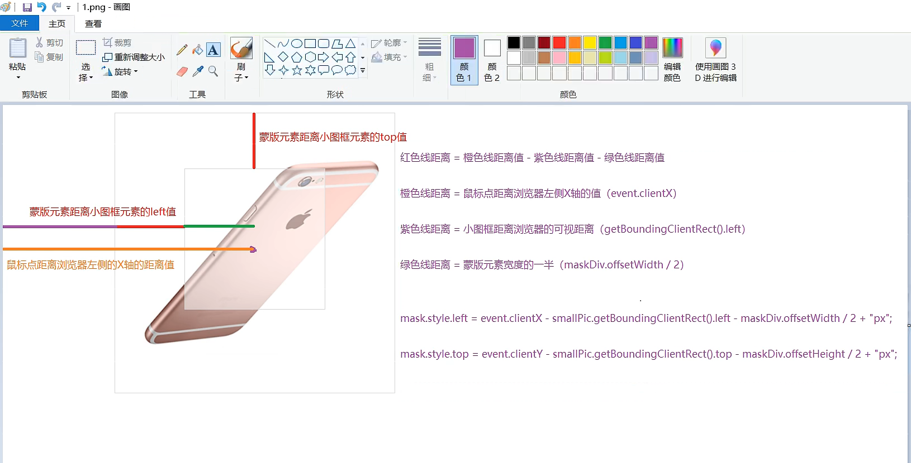
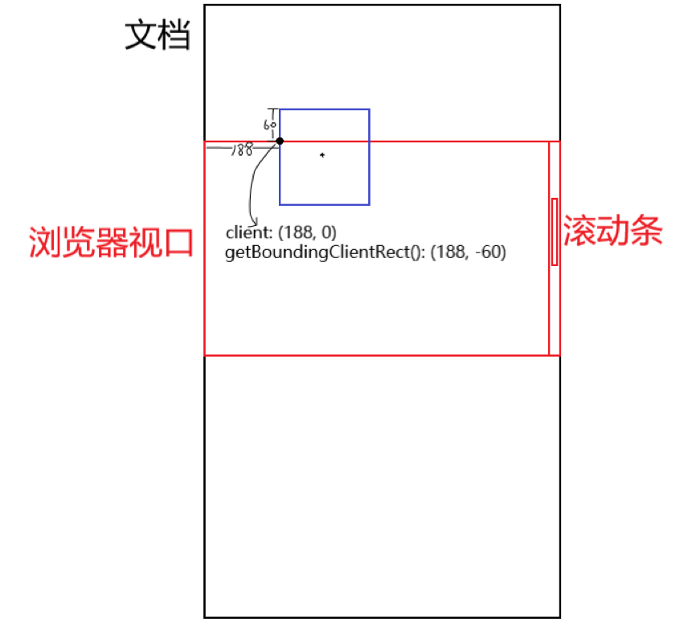

# 前端项目-尚优选（HTML/CSS/JS技术综合实战）

> 尚优选是一款HTML、CSS、JavaScript技术综合应用的商城项目，适合初学前端的小伙伴夯实基础，积累项目经验。项目具有很强的实用性，既是对前端基础知识的梳理和整合，同时为后续更多主流技术提供了实际应用的练兵场。

## 遇到的问题

1. 编写行内元素代码时，换行符会被浏览器渲染成空格，这会影响样式，因为多出了一个空格。解决办法：将行内元素的父级元素的字体大小设置为0，这样会让父级元素的内容变成空白，然后我们在行内元素中还原字体大小，这样就可以清除多余的空格。

2. 两个行内元素之间由于在编写代码时进行了换行，浏览器将换行符渲染成了空格，我们此时将第一个行内元素左浮动，那么第二个行内元素就会紧贴第一个行内元素，这样也能清除空格。

3. 如何设置`input`元素的`placeholder`的样式？使用伪元素`::placeholder`。

4. 蒙版元素的一些距离参数知识。

5. for循环是同步代码，事件函数是异步代码，同步代码执行完毕后才执行异步代码。事件函数内部用到的所有变量在外部声明时都必须用let声明，因为let是块级作用域。如果用var声明的变量在循环过程中发生了值的改变，那么同步代码for循环执行完毕，var声明的变量的值为循环完毕后的值，等到异步代码执行时，事件函数内部获取的变量始终是循环完毕后的变量值。
